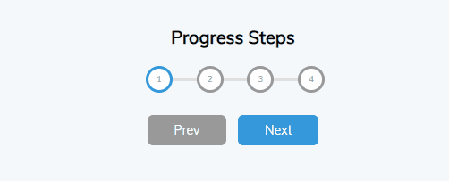

# Progress Steps

A simple progress steps component using Vanilla JS, CSS3, and HTML5. 

This was developed as a quick concept in a 50% size browser, it is not set up
to be properly responsive. 

[click here]()

